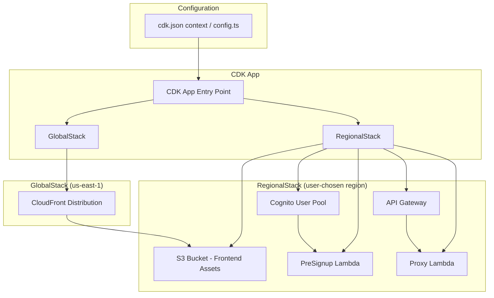
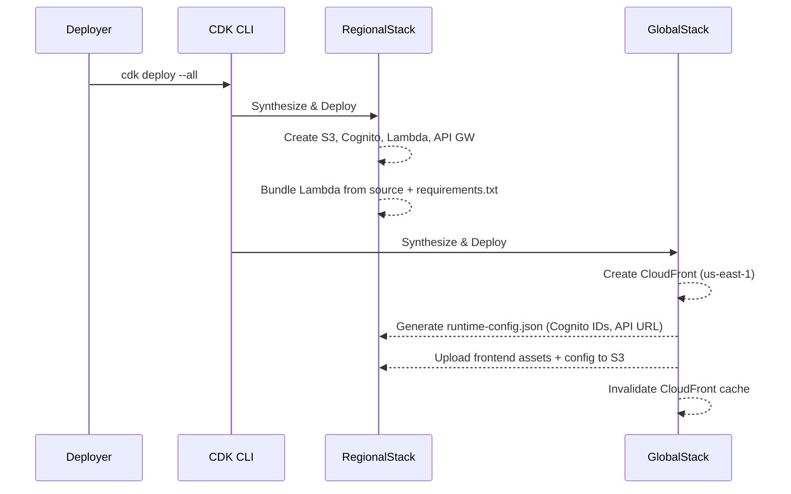

# Design Document: CDK Open Source Refactor

## Overview

This design transforms the Well-Architected Report Visualizer from a company-specific internal tool into a configurable, open-source CDK application. The solution replaces bash scripts and raw CloudFormation YAML with a TypeScript CDK application that reads deployment parameters from a configuration file, enabling any organization to clone, configure, and deploy.

The CDK app will be structured as a multi-stack application:
- **RegionalStack**: Deploys S3, Lambda (proxy + pre-signup), API Gateway, and Cognito to the user's chosen region
- **GlobalStack**: Deploys CloudFront distribution to us-east-1

All company-specific values (email domain, region, profile, project name, MFA policy, CORS, custom domain) become configuration parameters.

## Architecture



### Deployment Flow



## Components and Interfaces

### 1. Configuration Interface (`config.ts`)

Central configuration read from `cdk.json` context or a dedicated config file:

```typescript
interface DeploymentConfig {
  projectName: string;                    // Resource name prefix (default: "wa-visualizer")
  primaryRegion: string;                  // AWS region for regional resources
  emailRestriction: {
    enabled: boolean;                     // Toggle email domain restriction
    allowedDomains?: string[];            // Required when enabled=true
  };
  mfa: 'required' | 'optional' | 'off';  // Cognito MFA policy
  customDomain?: {
    domainName: string;                   // e.g., "visualizer.example.com"
    certificateArn: string;               // ACM cert ARN (must be in us-east-1)
  };
}
```

### 2. RegionalStack

Responsible for:
- S3 bucket (website hosting, OAC-only access)
- Cognito User Pool with configurable MFA and optional pre-signup trigger
- PreSignup Lambda (conditionally deployed when email restriction enabled)
- Proxy Lambda (bundled from `lambda/` with dependencies from `requirements.txt`)
- API Gateway (REST, POST /proxy endpoint with Cognito authorizer)

### 3. GlobalStack

Responsible for:
- CloudFront distribution with S3 origin (OAC)
- Optional custom domain + ACM certificate attachment
- S3 deployment of frontend assets + generated `runtime-config.json`
- CloudFront cache invalidation post-deploy

### 4. PreSignup Lambda (Python)

Configurable email domain validation:

```python
def lambda_handler(event, context):
    allowed_domains = os.environ.get('ALLOWED_DOMAINS', '').split(',')
    email = event['request']['userAttributes']['email']
    domain = email.split('@')[1]
    
    if domain not in allowed_domains:
        raise Exception(f'Registration restricted to: {", ".join(allowed_domains)}')
    
    event['response']['autoConfirmUser'] = True
    event['response']['autoVerifyEmail'] = True
    return event
```

### 5. Proxy Lambda (Python)

Existing `lambda_function_improved.py` with modifications:
- Remove hardcoded region — use `AWS_REGION` environment variable (set by Lambda runtime)
- Replace `Access-Control-Allow-Origin: '*'` with environment variable `ALLOWED_ORIGIN`
- Remove IP restriction logic (not needed with Cognito auth)

### 6. Frontend Runtime Configuration

Generated `runtime-config.json` uploaded to S3:

```json
{
  "userPoolId": "us-east-1_xxxxx",
  "clientId": "xxxxxxxxx",
  "region": "ap-southeast-2",
  "apiEndpoint": "https://xxx.execute-api.region.amazonaws.com/prod/proxy",
  "emailRestriction": {
    "enabled": true,
    "allowedDomains": ["example.com"]
  }
}
```

Frontend loads this at startup instead of using hardcoded values.

### 7. Repository Structure

```
├── infra/
│   ├── bin/
│   │   └── app.ts              # CDK app entry point
│   ├── lib/
│   │   ├── config.ts           # Configuration loading & validation
│   │   ├── regional-stack.ts   # S3, Cognito, Lambda, API GW
│   │   └── global-stack.ts     # CloudFront, S3 deploy, config generation
│   ├── cdk.json                # CDK config with deployment context
│   ├── tsconfig.json
│   └── package.json
├── lambda/
│   ├── proxy/
│   │   ├── lambda_function.py  # Proxy Lambda handler
│   │   └── requirements.txt    # Python deps (empty or minimal)
│   └── pre-signup/
│       └── lambda_function.py  # PreSignup Lambda handler
├── frontend/
│   ├── index.html              # Main page (renamed from wa-api-visualizer.html)
│   ├── js/
│   │   ├── app.js              # Main app logic (from script-improved.js)
│   │   └── auth.js             # Auth overlay (from auth-overlay.js)
│   └── config-loader.js        # Loads runtime-config.json
└── README.md
```

## Data Models

### Configuration Schema (cdk.json context)

```json
{
  "context": {
    "config": {
      "projectName": "wa-visualizer",
      "primaryRegion": "ap-southeast-2",
      "emailRestriction": {
        "enabled": false
      },
      "mfa": "optional",
      "customDomain": null
    }
  }
}
```

### Runtime Config (generated, uploaded to S3)

```typescript
interface RuntimeConfig {
  userPoolId: string;
  clientId: string;
  region: string;
  apiEndpoint: string;
  emailRestriction: {
    enabled: boolean;
    allowedDomains?: string[];
  };
}
```

### Lambda Environment Variables

| Lambda | Variable | Source |
|--------|----------|--------|
| Proxy | `ALLOWED_ORIGIN` | CloudFront domain or custom domain |
| PreSignup | `ALLOWED_DOMAINS` | Comma-separated list from config |

### Cross-Stack References

The GlobalStack receives outputs from RegionalStack:
- S3 bucket domain name and ARN
- Cognito User Pool ID and Client ID
- API Gateway URL

These are passed via CDK cross-stack references or explicit props.


## Correctness Properties

*A property is a characteristic or behavior that should hold true across all valid executions of a system — essentially, a formal statement about what the system should do. Properties serve as the bridge between human-readable specifications and machine-verifiable correctness guarantees.*

### Property 1: Configuration validation rejects invalid configs

*For any* configuration object, the config validator should accept it if and only if: (a) `emailRestriction.enabled` is a boolean, (b) when `enabled` is true, `allowedDomains` is a non-empty array of valid domain strings, (c) `primaryRegion` is a valid AWS region string, (d) `projectName` is a non-empty alphanumeric-with-hyphens string starting with a letter, (e) `mfa` is one of "required", "optional", or "off", and (f) `customDomain` is either null/undefined or contains both `domainName` and `certificateArn`.

**Validates: Requirements 1.1, 1.2, 2.1, 5.1, 6.1, 12.1**

### Property 2: Email domain validation correctness

*For any* email address and any list of allowed domains, when email restriction is enabled, the PreSignup Lambda should allow registration if and only if the email's domain (the part after @) matches one of the allowed domains. When email restriction is disabled, the lambda should allow any email.

**Validates: Requirements 1.3, 1.4, 1.5**

### Property 3: Project name prefix propagation

*For any* valid project name, all AWS resource names/identifiers generated by the CDK stacks should contain that project name as a prefix.

**Validates: Requirements 5.2**

### Property 4: Runtime config completeness

*For any* valid deployment configuration, the generated runtime-config.json should contain all required fields: `userPoolId`, `clientId`, `region`, `apiEndpoint`, and `emailRestriction` (with `enabled` and conditionally `allowedDomains`).

**Validates: Requirements 7.1**

### Property 5: CORS origin correctness

*For any* response from the Proxy Lambda, the `Access-Control-Allow-Origin` header should equal the custom domain if one is configured, otherwise it should equal the CloudFront distribution domain. It should never be `*`.

**Validates: Requirements 11.1, 11.3**

### Property 6: Frontend domain label reflects config

*For any* runtime config where email restriction is enabled, the rendered sign-up form label should contain each of the allowed domain strings from the config.

**Validates: Requirements 1.6**

## Error Handling

### Configuration Errors

- **Invalid config**: CDK synthesis fails fast with a clear error message indicating which field is invalid and what values are acceptable.
- **Missing required fields**: When `emailRestriction.enabled=true` but `allowedDomains` is missing/empty, synthesis fails with a descriptive error.
- **Invalid region**: If `primaryRegion` is not a valid AWS region identifier, synthesis fails.

### Runtime Errors

- **PreSignup Lambda**: Returns a Cognito-compatible error message when email domain is rejected. Logs the attempt for audit.
- **Proxy Lambda**: Returns structured JSON error responses with appropriate HTTP status codes (400 for bad requests, 500 for internal errors). Never exposes stack traces to clients.
- **Frontend config loading**: If `runtime-config.json` fails to load, the frontend displays a user-friendly error message indicating the app is misconfigured.

### Deployment Errors

- **Cross-region dependency**: GlobalStack depends on RegionalStack outputs. CDK handles this via cross-stack references. If regional deployment fails, global deployment is skipped.
- **Lambda bundling**: If `requirements.txt` contains packages that fail to install, CDK synthesis/deploy fails with pip error output.

## Testing Strategy

### Unit Tests

Unit tests verify specific examples and edge cases:

- Config validation: specific valid/invalid config examples
- PreSignup Lambda: specific email/domain combinations, edge cases (empty domain list, malformed emails)
- MFA configuration mapping: each of the three MFA values produces correct Cognito config
- Runtime config generation: verify output structure with specific inputs
- CORS header: verify header value with/without custom domain
- CDK synthesis: snapshot tests for synthesized CloudFormation templates

### Property-Based Tests

Property tests verify universal correctness across randomized inputs. Use **fast-check** (TypeScript) for CDK/config tests and **hypothesis** (Python) for Lambda tests.

Configuration:
- Minimum 100 iterations per property test
- Each test tagged with: **Feature: cdk-open-source-refactor, Property {number}: {property_text}**

Property test targets:
1. **Config validation** (fast-check): Generate random config objects, verify validator accepts valid ones and rejects invalid ones
2. **Email domain validation** (hypothesis): Generate random emails and domain lists, verify allow/reject logic
3. **Project name prefix** (fast-check): Generate valid project names, synthesize stack, verify all resource names contain prefix
4. **Runtime config completeness** (fast-check): Generate valid deployment configs, verify generated runtime config has all fields
5. **CORS origin** (hypothesis): Generate lambda events with various ALLOWED_ORIGIN env values, verify response header
6. **Frontend domain label** (fast-check): Generate configs with various domain lists, verify rendered label contains all domains

### Integration Tests

- CDK synthesis test: `cdk synth` produces valid CloudFormation for various config combinations
- Snapshot tests: detect unintended infrastructure changes

Each correctness property MUST be implemented by a SINGLE property-based test. Unit tests complement properties by covering specific edge cases and integration points.
