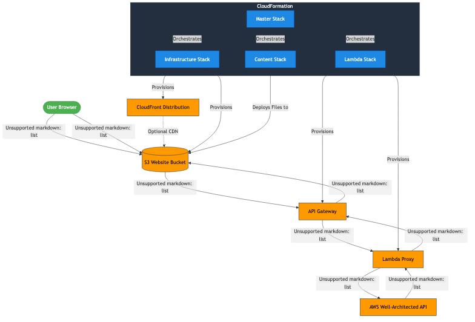

# Well-Architected Report Visualizer

A web-based visualization tool for AWS Well-Architected Framework reports. This solution allows users to view their workload assessment results in a user-friendly dashboard.

## Overview

The Well-Architected Report Visualizer provides a simple way to visualize and share the results of AWS Well-Architected Tool assessments. It solves the CORS (Cross-Origin Resource Sharing) issues that prevent direct browser access to the AWS Well-Architected API.

### Key Features

- View workload assessment results in a user-friendly dashboard
- Display risk distribution across Well-Architected pillars
- Show compliance percentages for each pillar
- List high, medium, and low risk items
- Provide recommendations based on assessment results

## Solution Architecture

The solution consists of the following components:

1. **Web Application** - A static website hosted in an S3 bucket
2. **Lambda Proxy** - A Lambda function that interfaces with the AWS Well-Architected API
3. **API Gateway** - An API Gateway that exposes the Lambda function to the web application
4. **CloudFront Distribution (Optional)** - A CloudFront distribution for improved performance and HTTPS

### How It Works

1. The user accesses the web application hosted in S3
2. The web application makes requests to the API Gateway
3. API Gateway forwards requests to the Lambda function
4. The Lambda function calls the AWS Well-Architected API using its IAM role
5. The Lambda function returns the results to the web application with proper CORS headers
6. The web application renders the data in a user-friendly dashboard

## Deployment

The solution is deployed using CloudFormation stacks. For detailed deployment instructions, see [Deployment Guide](README-deployment.md).

### Quick Start

1. Clone this repository
2. Make the deployment script executable: `chmod +x deploy.sh`
3. Run the deployment script: `./deploy.sh`
4. Access the web application using the URL provided in the deployment output

## Usage

For detailed usage instructions, see [Operation Guide](README-operation.md).

### Basic Usage

1. Open the web application in your browser
2. Enter a Well-Architected workload ARN or click "List Available Workloads"
3. View the generated report

## Security Considerations

- The Lambda proxy uses its own IAM role to access the Well-Architected API
- No AWS credentials are passed through the browser
- API Gateway can be configured with additional security measures
- CloudFront provides HTTPS encryption for the web application

## Customization

The solution can be customized in several ways:

- Modify the web application HTML, CSS, and JavaScript
- Update the Lambda function to add additional functionality
- Configure CloudFront with a custom domain and SSL certificate
- Add authentication to the API Gateway

## License

This project is licensed under the MIT License - see the LICENSE file for details.

## Contributing

Contributions are welcome! Please feel free to submit a Pull Request.

## Acknowledgments

- AWS Well-Architected Framework
- AWS CloudFormation
- AWS Lambda
- AWS API Gateway
